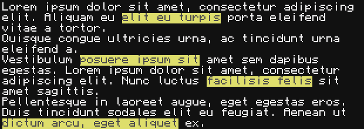

# Text Formatter
Text formatter (tf) is a basic computer craft text formatting system used for creating inline coloured text.
## Examples
```lua
local tf = require("tf")

local width, height = term.getSize()

local header = tf.createString("$b7 Current status ")
header = tf.align(header, width, "centre")
tf.write(header)

tf.print("$f8Turtle$f_    Mining Turtle           $feOffline")
tf.print("$f8Turtle$f_    Farming Turtle          $f5Online")
tf.print("$f8Server$f_    Chat Server             $f5Online")
```

```lua
local tf = require("tf")

tf.print("Lorem ipsum dolor sit amet, consectetur adipiscing elit. Aliquam eu $c74elit eu turpis$c__ porta eleifend vitae a tortor.\nQuisque congue ultricies urna, ac tincidunt urna eleifend a.\nVestibulum $c74posuere ipsum sit$c__ amet sem dapibus egestas. Lorem ipsum dolor sit amet, consectetur adipiscing elit. Nunc luctus $c74facilisis felis$c__ sit amet sagittis.\nPellentesque in laoreet augue, eget egestas eros. Duis tincidunt sodales elit eu feugiat. Aenean ut $c74dictum arcu, eget aliquet$c__ ex.")
```

# How to use
## Formatting
Tags are used to swich or suggest the formatting of the text. Tags always start with a `$` therefore in order to have a `$` as text you need to type `$$`. The current tags are shown in the table below.
| Tag        | Purpose                                                                                                                                                                                                                   |
| :--------- | :------------------------------------------------------------------------------------------------------------------------------------------------------------------------------------------------------------------------ |
| `$f{1}`    | Switch the colour of the text to be `{1}` where `{1}` is a hexadecimal digit referring to the colour in the current colour palette or a `_` specifying to use the default foreground colour.                              |
| `$b{1}`    | Switch the colour of the background below the current text to be `{1}` where `{1}` is a hexadecimal digit referring to the colour in the current colour palette or a `_` specifying to use the default background colour. |
| `$c{1}{2}` | Switch the foreground  and background colour of the text to be `{1}` and `{2}` respectively. Equivelent to `$f{1}$b{2}.`                                                                                                  |
| `$$`       | Writes a single $ character.                                                                                                                                                                                              |

For example, to send a message such as `ERROR    Turtle is on fire!` with the word `ERROR` having a red background and the word `fire` in orange, you would use `$beERROR$bf    Turtle is on $f1fire$f0!`.
## Quick start guide

For more detailed doccumentaion on every function please see the [wiki](https://github.com/Mcrevs/cc-text-formatter/wiki) page.

### Installing
Type the following command into the terminal to download the required lua file.
```
wget https://raw.githubusercontent.com/Mcrevs/cc-text-formatter/main/tf.lua
```
### Importing
Add this to the start of your program file to include the library. 
```lua
local tf = require("tf")
```
### Printing
Print a coloured string accross multiple lines if required.
```lua
tf.print("$feH$f1E$f4L$f5L$fbL$faO$f0 $cfeW$b1O$b4R$b5L$bbD$ba!")
```
